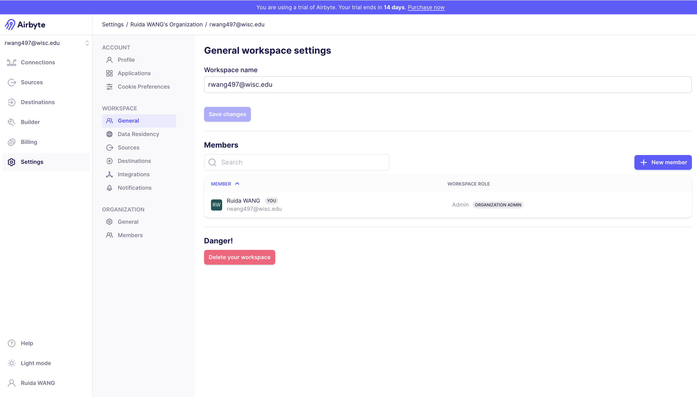
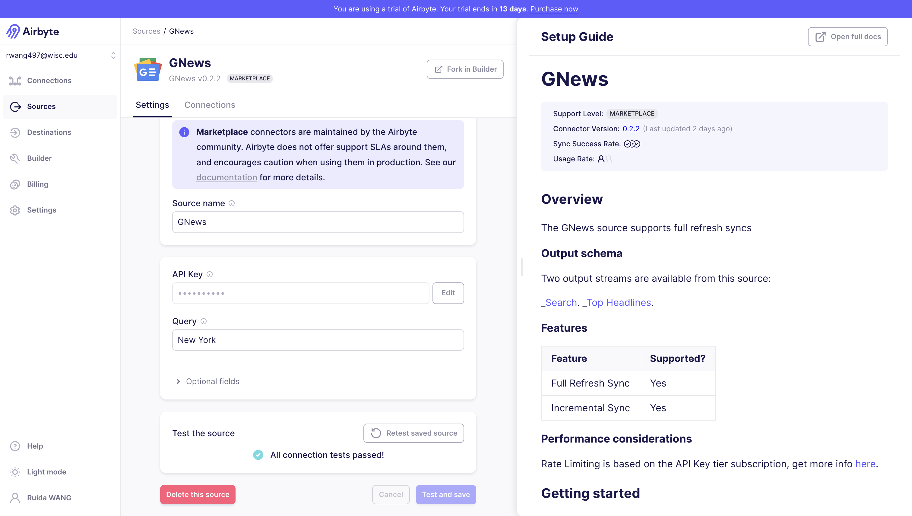
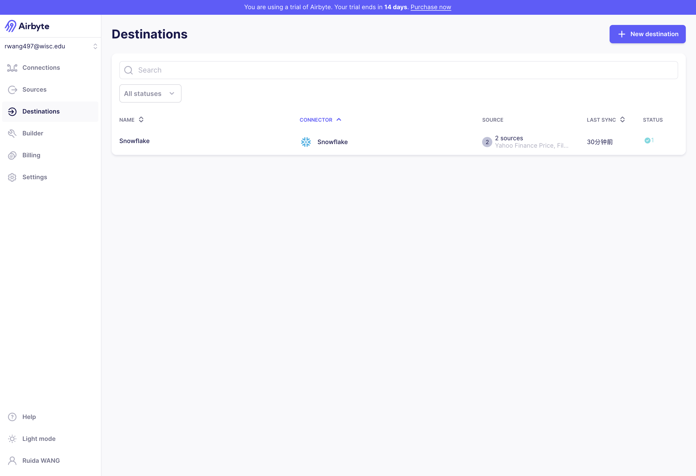

# P5 (6% of grade): ETL
GitHub Classroom Link: **[https://classroom.github.com/a/UGOl89jE](https://classroom.github.com/a/UGOl89jE)**

## Overview
In this project, you will get familiar with ETL workflow in data analysis, using Airbyte to Extract and Load the data, and DBT to Transform data. We will use the NYC Taxi dataset.

Learning Objectives:
1. Learn to set Airbyte online tool.
2. Explore combining Airbyte and DBT in Snowflake to jointly process the data
3. Get the experience in writing a data analysis report。

Before starting the project, please view the [general project directions](https://github.com/CS639-Data-Management-for-Data-Science/f24/blob/main/projects.md).

:warning: :warning:  :warning:**[IMPORTANT] Submission Policy**: This project is a little different from other projects, you need to submit a typed PDF file that explains how you complete the project. We recommend you either use Overleaf to Latex to type it or compile a Markdown into a PDF or generate a PDF from word or google docs. We DO NOT accept handwritten submissions. Even if you have a **project partner**, please make sure to submit individual reports, but add your partner information to the top of your report.

⚠️ The project will be in ~~three~~ two parts. ~~**The latter half of this project will be HARD! We recommend you start early**.~~

⚠️ Please use Piazza to post (public/private) any questions regarding this project, as e-mails will NOT be answered. If you need to include your code to get help, please make a private post.

## Corrections / Clarifications
- 10:15 a.m. Nov 6th 2024: Update GNews and Part 2 submission instructions
- 11:55 a.m. Nov 6th 2024: Delete part3 and update submission instructions for Part 2
- 3:21 p.m. Nov 6th 2024: Added GitHub classroom link


## 1. Extract and Load data using Airbyte (6 points)

### 1.1 Register Airbyte Account (1 point)

We will use the web version of Airbyte for this project. You need to register an Airbyte web version account at [`https://airbyte.com/`](https://airbyte.com/) and claim your 14-day free trial for Airbyte using your wisc email. We will use Airbyte to extract and load most of our data to Snowflake. 

To get credit for this question, include the Settings > Workspace > General screenshot in your submitted report. The example plot is as follows:




### 1.2 Extract data

#### 1.2.1 Extract data from the Airbyte source market (1 point)

The biggest advantage of using Airbyte in the industry is that it has various data sources in its market. However, most of them require paid API keys or business-level databases. Thus, this section only intends to let you experience setting a sample data source from the market and synchronizing it to Snowflake. 

You need to go to the sources marketplace of Airbyte, find the GNews source, setting up all the configurations (you need to register a GNews account to have an API key for that). Then test the source. If the test passes, it should look as follows:



#### 1.2.2 Extract data from your CSV file (1 point)

In the process of data analysis, you do not always have the data source set at some pre-configured sources in Airbyte. You may need to load your private CSV file to the database for analysis. In this project, we will use the NYC Taxi Zone lookup table provided in [`https://d37ci6vzurychx.cloudfront.net/misc/taxi_zone_lookup.csv`](https://d37ci6vzurychx.cloudfront.net/misc/taxi_zone_lookup.csv). Set up this source in Airbyte by using `File` in Sources.

---

To obtain credits in this section, you are required to include the screenshot of your `Sources` section in the Airbyte in the report. the sources should contain `GNews` and `File` for two extractions. You should also clearly show the `e-mail` and `name` of your account in the screenshot. The example plot is as follows:


### 1.3 Setup Snowflake (1 point)

The Snowflake is a popular tool in the industry to transform and perform data analysis. We will guide you to get some hands-on experience with Snowflake. Firstly, you need to register a Snowflake account; you will have a 30-day free trial and $400 credits, which will be quite enough for you. 

To get credit for this question, you need to find your account URL and then include it in your submitted PDF and also put the link into `snowflake_account.txt` file in your git repo. Your account URL should be like `https://xxx.{region}.xxx.snowflakecomputing.com`.

### 1.4 Connect Airbyte to Snowflake (1 point)

To extract data in Airbyte and load it to Snowflake, you need to set a connection between them. In the Airbyte WebUI. You can set up the connection to Snowflake in the `Destinations` sections. The guide for connection can be found in [here](https://docs.airbyte.com/integrations/destinations/snowflake?_gl=1*6fqg41*_gcl_aw*R0NMLjE3Mjk1MjI4MTEuQ2owS0NRanc5OWU0QmhEaUFSSXNBSVNFN1BfYWZuTEtHN3BlUWxlbmZXOW14Q0otaXRwWG0zV0xsM1pjeGpjQWt6bE9sQS1oNTFZODE5a2FBc3lIRUFMd193Y0I.*_gcl_au*NzUxMzA5NTcyLjE3MjkwMDUxMzUuMzk0OTIyMjM4LjE3MzAzMTIyMDEuMTczMDMxMjcyMQ..). After setting up the connection, you are able to transfer data to Snowflake.

To get credit for this question, you are required to include the screenshot of page `Destinations` in Airbyte WebUI in your submitted report, the connection should be healthy. You should also clearly show the `e-mail` and `name` of your account in the screenshot. The example plot is as follows:



### 1.5 Load data to Snowflake

#### 1.5.1 Synchronizing data from Airbyte to Snowflake (1 point)

You can use Airbyte to build a connection to Snowflake to transform data. In the `Connections` part of Airbyte, use `New Connection` to upload both datasets to Snowflake. In this project, your setting can be overwrite-only. 

#### 1.5.2 Directly upload data to Snowflake (1 point) 

Another way to load your private data to Snowflake is to directly upload the dataset file to Snowflake. This is typically used in the case where you do not need to update the dataset from time to time. In this project, we will upload the NYC Taxi record dataset to Snowflake. In particular, we will use  Yellow Taxi Trip Records in June 2024. The data can be downloaded from [`https://d37ci6vzurychx.cloudfront.net/trip-data/yellow_tripdata_2024-06.parquet`](https://d37ci6vzurychx.cloudfront.net/trip-data/yellow_tripdata_2024-06.parquet). A detailed documentation of this dataset can be found at [`https://www.nyc.gov/assets/tlc/downloads/pdf/data_dictionary_trip_records_yellow.pdf`](https://www.nyc.gov/assets/tlc/downloads/pdf/data_dictionary_trip_records_yellow.pdf). 

You need to firstly download the data to your own computer, then upload it to the Airbyte created DB in Snowflake. **Note: You should use defaule column name when uploading the dataset, since other name may disrupt autogravder**

---

To get credits for Question 1.5, you need to write SQL queries in Snowflake to obtain 5 example lines in` NYC taxi` record dataset, `Taxi zone` dataset, and `GNews` dataset. Name them as `taxi_record.csv`,  `taxi_zone.csv`, and `GNews.csv`. Add them to the GitHub Repo. In terms of GNews result, both `TopHeadings` and `Search` table result are ok.


## 2 Transform data (4 points)

In this section, you can freely select your favorite DBT tools (we suggest you use SQL) in Snowflake. We will check the correctness of your data only on results. 

You need to transform the pick-up location ID (`PULOCATIONID`) drop-off location ID (`DOLOCATIONID`) of the original data into seven districts of NYC list as follows:
1. Manhattan
2. Brooklyn
3. Queens
4. Bronx
5. Staten Island
6. EWR (airport)
7. Others

Submission instructions for this section:
1. Report the portion of the data within these areas in a file named `Q2_answer.txt`. The format should be as follows: **(Note: The classes you have should be correct, but do not need to be extremely accurate about the numbers, as long as it is in a valid range, it will be ok)** (2 points)
```text
Pick-up:
Manhattan: 0.xxxx
Brooklyn: 0.xxxx
Queens: 0.xxxx
Bronx: 0.xxxx
Staten Island: 0.xxxx
EWR: 0.xxxx
Others: 0.xxxx

Drop-down:
Manhattan: 0.xxxx
Brooklyn: 0.xxxx
Queens: 0.xxxx
Bronx: 0.xxxx
Staten Island: 0.xxxx
EWR: 0.xxxx
Others: 0.xxxx
```
2. Add a `SQL` or `Python` or any other method you use in your report and detail how you achieve such transformation. (2 points)


~~## 3 Write analysis report (2 points)~~

~~**This part will be completion-based, as long as you submit a valid result, you will be granted credits**~~
~~Find your favorite map of NYC, export it into Snowflake, and randomly sample 10k data points from your processed dataset last step. Put the pick-up location location on the map, and use 7 different colors to represent the meter-disengaged location. Export and upload the map.~~


