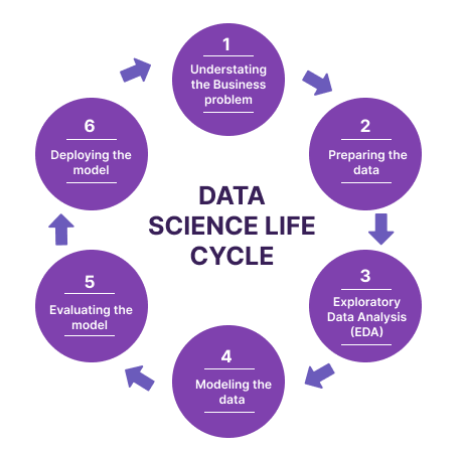
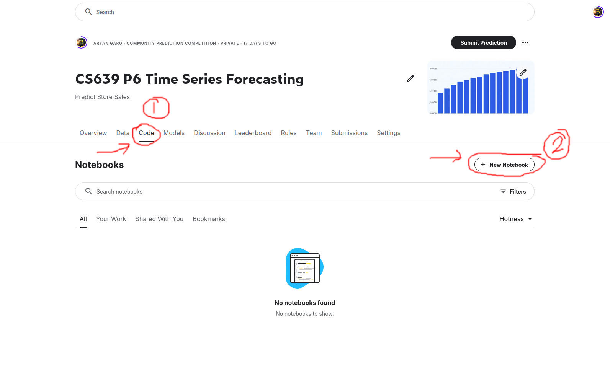

# P6 Time Series Analysis

* **Competition invite link: https://www.kaggle.com/t/8aca849f667809c7fb568e2845e7f44c**
* **Github Classroom Invite for P6: https://classroom.github.com/a/PCd71f6r**

---      

## Learning Objectives

1. Carrying out thorough exploratory data analysis (and carry out basic feature engineering)
2. Implement simple statistical models: Linear Regression and ARIMA (understand PACF and ACF) 
3. Implement (out of the box) and contrast popular gradient boosting algorithms for time series prediction: XGBoost, LightGBM, and CatBoost
4. **[Optional]** Compete in addition to time-attack deadlines - for fun and handling the constant technological innovation mental burden
5. Another main objective of this assignment is to go through a typical data analysis/science project's life cycle: 

---

## Setup

1. Create a Kaggle account *with your wisc email*, if you don't have one already. Signup here: https://www.kaggle.com/
2. Join the Kaggle competition: https://www.kaggle.com/t/8aca849f667809c7fb568e2845e7f44c
3. Go to the *Code* Tab and create a new notebook:

   

4. Download the [starter notebook](starter.ipynb) provided and then import it into the notebook you just created on Kaggle.

⚠️ We 'need' step 4 for autograding

---


## Section 1: EDA & Feature Engineering

Concepts: Plotting, correlations, data imputation, leakage, one-hot encoding.

--- 

### Analyzing the feature: Transactions (Correlations and average trends)

**Q1. Left join transaction to train and then print the *Spearman Correlation* between Total Sales and Transactions. Don't forget to join the respective dates on the test split. [0.1 Points]**

**Q2. Plot an 'ordinary least squares' trendline between transactions and sales to verify the spearman correlation value in Q1. [0.1 Points]**

**Q3. Plot these **line** charts in the notebook:**

**A) Transactions vs Date (all stores color coded in the same plot)**      
**B) Average monthly transactions**          
**C) Average Transactions on the days of the week**          

**What observations can you draw from these plot? [0.3 Points]**

1. x-axis should only display years (2013, 2014, 2015, 2016 and 2017). A, B and C are single plots.
2. Use plotly.
3. Write the observations in a markdown cell.

**NOTE:** Your plots should be rendered in the notebook for you to receive credit.

--- 

### Analyzing the feature: Oil (Data Imputation, Correlation can be deceptive)

**Q4. Use pandas' in-build (linear) interpolation to impute the missing oil values then (plot) overlay the imputed feature over the original.**

* Learn to use [NumPy's where](https://numpy.org/doc/stable/reference/generated/numpy.where.html) and [Pandas' interpolate](https://pandas.pydata.org/docs/reference/api/pandas.Series.interpolate.html)

**Q5. Again, left join oil on the dataframe above and report the spearman correlation between `oil and sales` and `oil and transactions`. Don't forget to join oil (respective dates) on the test split as well. [0.1 Points]**

**Q6. Report the top-3 highest negative correlations between `oil and sales of a particular product family`. Now think whether oil should be discarded as a feature? [0.1 Points]**

* Always think intuitively as well: Oil should affect an oil-dependent country! The problem statement/dataset description also said that.
* Maybe not all products are affected by oil change. People still need to eat. So bread might not be affected so much!
* If correlation values don't align with your intuition or facts, maybe you're hypothesis or dataset view is wrong?

--- 

### Data Leakage 😵‍💫

**Q7. Which 2 features do you think fit the description of look-ahead data leakage? [0.1 Points]**

* Notebook should print:
```The 2 data leakage features are: <feature-1> and <feature-2>```

* Note feature names should exactly match column names.

<details>
  <summary>Hint: Types of Leakages and their definitions:</summary>
  <p>
    <ul>
      <li> Preprocessing Leakage: This occurs when preprocessing (like scaling or normalization) is done on the entire dataset, rather than separately on the training and test datasets. For example, if you normalize the entire dataset to have a mean of 0 and a standard deviation of 1, and then split it into training and test sets, the test set's statistics will have influenced the training set's preprocessing.

    <li> Feature Engineering Leakage: This happens when features are created using information from the entire dataset. For instance, if you're trying to predict whether a user will buy a product and you create a feature that counts the number of products bought by a user, including data after the split date, you've introduced future information into the past.

    <li> Model Validation Leakage: If you use the test set to make decisions about model architecture, hyperparameters, or other aspects of the model, you're effectively using the test set as part of the training process. This can lead to overfitting to the test set.

    <li> Temporal Leakage: In time series data, using future data to predict past events is a common form of leakage. For example, if you're trying to predict stock prices, using tomorrow's price as a feature to predict today's price would be a clear case of data leakage.

    <li> External Data Leakage: If you enrich your dataset with external data, you must ensure that this data would have been available at the time of prediction. For instance, if you're predicting store sales for a particular month and you add weather data, you must ensure that you're not using weather data from after the month you're trying to predict.
  </ul>
  </p>
</details>

--- 

### One-hot encoding: holidays &  events

**Q8. One hot encode the holidays and events data and similarly left join it to the the main dataframe. Don't forget to do the same for the test set.**

---    

### Section 2: Statistical Models

**Recommendation:** Even though the assignment does not ask for plots. Visualizing the prediction helps build intuition.

**Q9. Make a submission using an exponential moving average (EMA) model for each of the product families per store.**

* ```each of the product families per store``` means you will have to train 1782 models (should take ~7 mins to fit on CPU)

Unlike Simple Moving Average and Cumulative Moving Average (concepts you should also be familiar with), Exponential Moving Average gives more weight to the recent observations and as a result of which, it can be a better model or better capture the movement of the trend (and is also faster). 
(EMA's reaction is directly proportional to the jumps in data unlike other MA methods)

**Q10. Make a submission using a simple Linear Regressor for each of the product families per store.**

* ```each of the product families per store``` means you will have to train 1782 models (should take ~7 mins to fit on CPU)
* You need to drop the train columns: id (useless feature), date (already sorted), store_nbr (already accounted), family (already accounted), sales (gt)
* Same with test (except the sales column)
* Take care of under/overflow by proper typecasting. 


**Q11. What are PACF and ACF? Analyze the time series by plotting the ACF and PACF with lag 20 for each product family**

* You should have 33 x 2 plots rendered.
  
**Q12. Perform the ADF test on the difference series for a valid ARIMA model. Then fit an ARIMA/SARIMA model with the appropriate p, d and q values. Make a submission.**

* Print the ADF statistic and corresponding p-value.
* Print the summary after fitting the model. (Should have Jarque-Bera, Ljung-Box, Heteroskedasticity, Skew and Kurtosis) $\rightarrow$ lookup what these tests mean! 

---

### FYI

Comparison Summary Table
| Model                   | Use Case                  | Advantages                                              | Limitations                                          |
|-------------------------|---------------------------|---------------------------------------------------------|------------------------------------------------------|
| **ARIMA**               | Complex time series data with autocorrelation | Handles trends, seasonality, noise                      | Requires stationary data, parameter tuning           |
| **EMA**                 | Short-term trend analysis | Easy to implement, recent data weighted more            | Limited forecasting capability, doesn’t handle seasonality well |
| **Linear Regression**   | Linear relationships      | Simple, interpretable, works with multiple predictors   | Assumes linearity, limited in non-stationary series   |


---

## Section 3: Gradient Boosted Tree Methods

**NOTE 1:** Do not worry/get hung up on Q12-14 trying to find the best hyperparameters by hit and trial. Q15 will show you a method that finds (sub) optimal hyperparamters automatically.

**NOTE 2:** You should be using all features so far except `id` for the subsequent submission questions.

**Q13. Define a validation set. What will be the most appropriate time period for this validation set?**

<details>
  <summary>
    Hint:
  </summary>
  <p>
    The validation set should ideally reflect the entire distribution of sales to make robust and generalizable models. However, since the test set is also biased towards a time-period here, the validation set should represent the test set well to achieve a lower metric score. <b>This is a big reason why models from Kaggle are often over-fitted and not deployable unless the competition hosts come up with extensive testing sets and/or metrics.</b>
  </p>
</details>


**Q14. Make a submission using LightGBM**


**Q15. Make a submission using a CatBoost model**


**Q16. Make a submission using an XGBoost model.**


**Q17. Use optuna for automatic hyperparameter optimization for your models in questions 12, 13 and 14  to achieve a lower RMSLE.**

* Recommendation: Try 10 trials for each method.

**Q18. Which out of the three Catboost vs LightGBM vs XGBoost provides the best score? Why do you think this model is more suited to this dataset/problem?**

---

<!--- 
## Section 4: Interpretable N-BEATS


**Q19. What makes N-BEATS, a deep neural network, interpretable especially when they (DNNs) are notoriously known for their un-explainability?**

**Q20. Make a submission using the N-BEATS model. Then repeat Q17 for this model and make another submission. How much did your RMSLE change? (hyperparameters matter!)**

---  
-->

## [OPTIONAL] Does competition get the blood flowing for ya? 🤠 Then climb the ranks! Potential to earn extra credit*

*To earn *extra credit 💰*, achieve a *top-3 position* on the leaderboard. If your total score points is closer to a better letter grade, we'll use this ranking to boost the letter grade.

<details>
  <summary>
    Hint 1:
  </summary>
  <p> Having a solid/robust/represenatative of the underlying (true) distribution cross-validation set will help you more than you can imagine. Advice applicable till the end of times. </p>
</details>

<details>
  <summary>
    Hint 2:
  </summary>
  <p>Most Kaggle competitions are won by using an <b>ensemble</b> of methods. Try different variations! </p>
</details>

<details>
  <summary>
    Hint 3:
  </summary>
  <p>N-BEATS is a great deep learning based method. Try it out!</p>
</details>


---      

## Submission 

Download your final Kaggle notebook and upload it on your github repo for p6.

**NOTE: For this assignment, the TAs will grade manually. There is NO autograder.**

---

---

## Think Data Science is dying? 

### Hear it from a Kaggle Grand Master himself on the state of current research for AI with data science:


